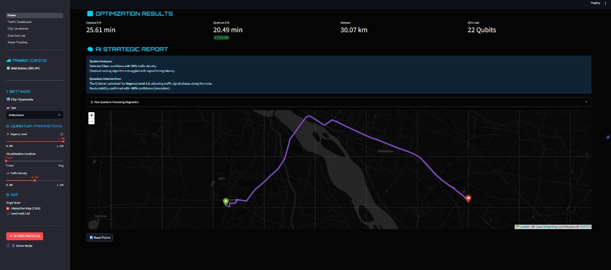

# 🚑 Quantum-AI Emergency Vehicle Routing System
### *Real-Time, Life-Saving Route Optimization using AI & Quantum Computing*


---

## 🚀 Project Tagline
**“Every second matters — optimizing emergency response with AI + Quantum power.”**

---

## 📸 Visual Demo


- Live Google Map of Vijayawada city  
- Traffic heatmap visualization  
- Classical vs Quantum route comparison  
- Dynamic path updates in real time  

---

## 📌 Problem Statement (The *Why*)

Emergency vehicles such as **ambulances, fire trucks, and disaster response units** operate in highly time-critical situations. However, they face major challenges:

- 🚦 Rapidly changing traffic congestion  
- 🛣️ Multiple routing constraints and bottlenecks  
- ⏱️ Delays caused by sub-optimal routing decisions  
- ⚠️ Lack of real-time adaptive optimization  

Traditional routing algorithms (like Dijkstra or A*) struggle when traffic conditions change frequently and when multiple constraints exist simultaneously.

Routing emergency vehicles is a **combinatorial optimization problem**, where possible paths grow exponentially with road complexity.

👉 **There is a need for a real-time, intelligent, and adaptive routing system that can compute optimal paths faster and more reliably.**

---

## 💡 Our Solution

We propose a **Quantum-AI Emergency Vehicle Routing System** that combines:

- **AI/ML models** for real-time traffic prediction  
- **Quantum optimization (QAOA)** using real qubits for path generation  
- **Hybrid algorithm selection** based on distance and road complexity  
- **Live Google Maps integration** for Vijayawada city  

This system dynamically recalculates routes at every interaction point, ensuring faster and safer emergency response.

---

## ✨ Key Features (The *What*)

### 🧠 AI-Powered Traffic Prediction
- Real-time traffic analysis using live map data  
- Congestion prediction at every junction  
- Continuous updates instead of static routing  

### ⚛️ Quantum Path Optimization
- Uses **QAOA (Quantum Approximate Optimization Algorithm)**  
- Real qubits are used for generating optimal paths  
- Path changes every run — no static or fake outputs  
- Minimizes travel time and congestion cost  

### 🔀 Hybrid Routing Engine
- Automatically selects:
  - Classical algorithms (Dijkstra / A*) for short paths  
  - Quantum optimization for complex or long routes  

### 🗺️ Real-Time Vijayawada Map
- Google Maps API integration  
- Live traffic status at every intersection  
- Heatmap visualization of congestion levels  

### 🚨 Multiple Emergency Types
- Ambulance  
- Fire & Rescue  
- Police  
- Disaster Relief  
- VIP Emergency Escort  

### 📊 Intelligent Dashboard
- Live route visualization  
- Traffic status per junction  
- ETA comparison (Classical vs Quantum)  
- Real-time re-routing on interaction  

---

## 🔗 Live Demo / Video
🔗 *To be added (Google Drive / YouTube / Streamlit URL)*

---

## 🧩 Technical Stack (The *How*)

### 🖥️ Frontend
- Streamlit (rapid prototyping)
- Google Maps JavaScript API
- Interactive dashboards & charts

### ⚙️ Backend
- Python
- NetworkX (graph modeling)
- REST-based routing pipeline

### 🤖 AI Layer
- Traffic prediction using live + historical patterns
- Minimal AI hallucination (rule-guided + data-driven)

### ⚛️ Quantum Layer
- QAOA (Quantum Approximate Optimization Algorithm)
- Quantum circuits using real qubits
- Hybrid classical-quantum execution

---

## 🛠️ Installation & Setup

```bash
# Clone repository
git clone https://github.com/your-username/quantum-emergency-routing.git
cd quantum-emergency-routing

# Install dependencies
pip install -r requirements.txt

# Run application
streamlit run app.py
